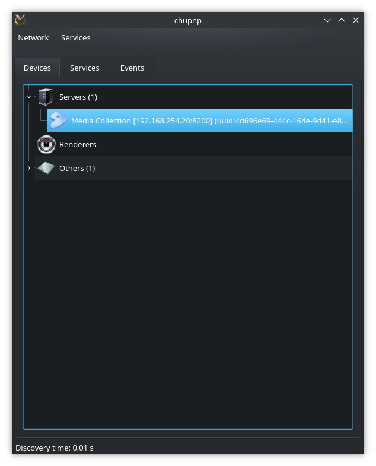
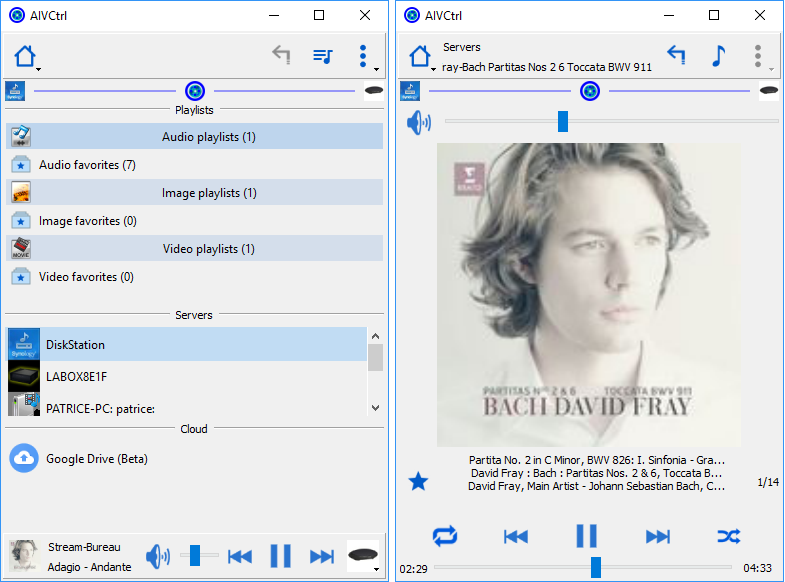

QtUPnP
======

Overview
--------

QtUPnP framework is a C++ framework, based on QT5, to build easily an UPnP control point.

This particular project is a fork of <a href="https://github.com/ptstream/QtUPnP">https://github.com/ptstream/QtUPnP</a>.

You can find additional docs in the ``/upnp/docs/html.zip`` zip file.

**Original Author Remarks**
- The framework use only QT API.
- The folder upnp contains the framework to encapsulate the UPnP protocol. By default, it is a dll for Windows and a static library for all other systems.

**Current Author Remarks**

- Google drive plugin and support will not be supported due to the legacy Operating Systems supported in this version. See https://github.com/ptstream/QtUPnP
  if you want this feature.
- Changes to this fork include removing c++11 and later features and writing CMakeLists.txt files to replace .pro files.

Support
-------

What makes this fork unique and useful is that the code has been back-ported to support pre-``C++-11`` standards so the following OS's are "supported":

  - Windows XP/7: Untested, but planned support. Use MSVS 2010-2013 with appropriate Qt5.3.{1,2} binaries installed as well as dependencies

  - Linux: Modern Linux with 5.15 is compatbile

  - OS X 10.6.8+: Snow Leopard with Clang 3 / g++ 4.2 and XCode update.

Building requires CMake.

Roadmap
-------

 - [ ] Rename project from QtUPnP: While it may mirror some features of the original fork, this is its own fork that will not be using higher c++ standards
       to maintain compatibility. I'm thinking something like "QtUPnP Retro" or "QtUPnP Legacy" or "QtUPnP SLE" (Snow Leopard Edition)

 - [ ] Use library in other projects I'm working on, perhaps this will begin an initiative to build in ctests. The focus going forward is to ensure easy
       configuration of upnp servers specifically for audio and video playback (ie: for audio players on older operating systems)

*************** chupnp *******************

chupnp is an application for developers to test the framework. You can see the documentation at /QtUPnP/chupnp/docs/Test QtUPnP with chupnp.pdf
The main functionalities are:
  - Discover devices
  - Choose devices.
  - Invoke the actions.
  - and see the detailed results.
  - ...
  
  
*************** AIVCtrl *******************

**TODO**

 - [ ] Write CMakeLists.txt file to compile project and widgets

<!--  -->

aivctrl is a control point for users to drive media servers and media renderers. The user documentation it in /QtUPnP/aivctrl/doc
The main fonctionnalities are:
  - A remote control format (small size on the screen).
  - Discover and show servers and renderers.
  - Browse the servers content.
  - Manage renderers like a player (volume, seek, mute, suffle, repeat, cover, previous, next...).
  - Manage audio, image, video playlists and favorites.
  - Verify playlist elements.
  - And a lot of another things.
  
Supported Hardware and Systems
------------------------------

 - Using minidlna on server hardware to provide over 13k audio files and many video files for testing

No clients are written using this library so no statements can yet be made regarding the above supported OS's using this QtUPnP library.

Help and Contributions
----------------------

If you have problems with this library on the aforementioned Operating Systems, please file an issue.

If you have QtUPnP working, please file an issue with your hardware, software and av player(s) used so they can be marked down.

